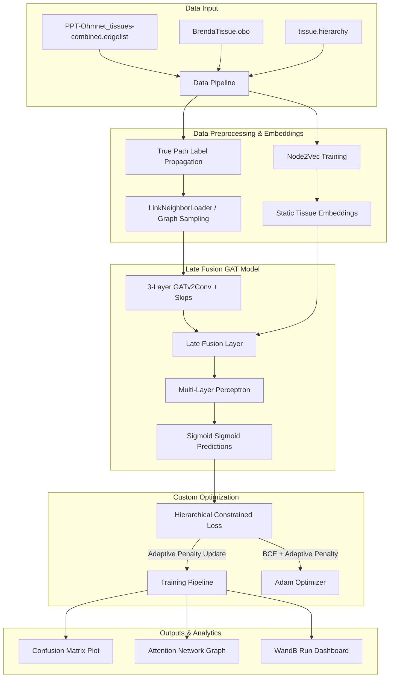

# 🧬 OhmNet GAT Extension: Modular Pipeline

[](https://www.python.org/)
[](https://pytorch.org/)
[](https://pytorch-geometric.readthedocs.io/)
[](https://wandb.ai/)

Welcome to the modularizedimplementation of the **Late Fusion Graph Attention Network (LF-GAT)** for tissue-specific protein-protein interaction (PPI) function prediction. 

This repository transitions the initial exploratory research notebook into a highly structured, scalable, production-grade deep learning pipeline. By decoupling data preprocessing, model architecture, custom loss functions, and evaluation metrics, this codebase facilitates rapid experimentation, reproducibility, and robust CLI execution.

---

## 🏗️ Architecture & Pipeline Overview

The modular pipeline implements an advanced supervised learning workflow that fuses network topology with anatomical hierarchy:



---

## 📂 Project Structure

The project has been refactored into focused, reusable modules under the `src/` directory:

```bash
Ohmnet GAT Extension/
├── data/                          # Raw datasets & ontology reference files
│   ├── BrendaTissue.obo           # BRENDA Tissue Ontology definitions
│   ├── PPT-Ohmnet_tissues...      # Multi-tissue PPI network edgelist
│   └── tissue.hierarchy           # Directed graph parent-child relations
├── models/                        # Serialized training artifacts (created dynamically)
│   ├── best_model.pt              # Top-performing GAT model weights
│   └── final_attention_coefs.pt   # Extracted GAT attention weights
├── outputs/                       # Generated analysis plots (created dynamically)
│   ├── confusion_matrix.png       # Global classification metrics
│   └── attention_plot.png         # Hub protein attention visualization
├── src/                           # Pipeline source code modules
│   ├── __init__.py
│   ├── analyze_attention.py       # Multi-head attention extraction & spring-layout plots
│   ├── config.py                  # Seeding, directory mappings, & hyperparameters
│   ├── data_pipeline.py           # Parsing, True Path propagation, & graph data loaders
│   ├── eval.py                    # Validation threshold optimization & test set metrics
│   ├── loss.py                    # Custom loss function & hierarchical violation checkers
│   ├── models.py                  # PyTorch Geometric LateFusionGAT model implementation
│   └── train.py                   # Adaptive penalty training loop & early stopping
├── Notebooks/                     # Exploratory research notebooks
│   └── README.md                  # Notebook-specific experimental notes
├── .env                           # Environment variables (WandB API key)
├── main.py                        # Central command-line interface entry point
└── README.md                      # This project-wide documentation
```

---

## 🔧 Installation & Setup

### 1. Prerequisites
- **Python 3.12+**
- **CUDA-compatible GPU** (Recommended, min 12GB VRAM) or CPU setup.

### 2. Environment Setup
Clone the repository, initialize a virtual environment, and install the required scientific dependencies:

```bash
# Create a virtual environment
python -m venv venv
venv\Scripts\activate      # On Windows
source venv/bin/activate    # On macOS/Linux

# Upgrade pip and install standard dependencies
pip install --upgrade pip
pip install torch torchvision torchaudio --index-url https://download.pytorch.org/whl/cu121
pip install torch_geometric pyg_lib torch_scatter torch_sparse torch_cluster torch_spline_conv -f https://data.pyg.org/whl/torch-2.0.0+cu121.html

# Install remaining dependencies
pip install networkx pandas numpy scikit-learn matplotlib pronto python-dotenv wandb
```

### 3. Configure API Keys
For experiment tracking with Weights & Biases (WandB), create a `.env` file in the root directory:

```env
WANDB_API_KEY=your_actual_wandb_api_key_here
```

---

## 🏃 Running the Pipeline

All steps of the pipeline are orchestrated through `main.py` via command-line flags. You can run individual pipelines or combine them sequentially.

```bash
# Display help and available arguments
python main.py --help
```

### Options:
- `--train`: Execute the full model training pipeline.
- `--eval`: Run test-set evaluation using the saved `best_model.pt` checkpoint.
- `--attention`: Extract GAT attention coefficients and visualize neighbor networks.
- `--use-wandb`: Enable experiment logging to the Weights & Biases dashboard during training.

---

### 🏋️ 1. Training the Model
To execute the data preprocessing, label propagation, `Node2Vec` tissue embedding training, and `LateFusionGAT` training loop:

```bash
# Local training (without WandB tracking)
python main.py --train

# Training with real-time Weights & Biases tracking
python main.py --train --use-wandb
```

*Note: Training implements **Early Stopping** based on validation loss (patience=50). A cached tissue representation is automatically generated and saved to `data/tissue_embeddings.pt` to expedite future runs.*

---

### 📊 2. Evaluation
Evaluate the trained checkpoint (`best_model.pt`) on the test dataset. This step will automatically search for the optimal decision threshold on validation data to avoid target leakage, calculate leaf-tissue metrics, check hierarchical consistency, and generate a global confusion matrix:

```bash
python main.py --eval
```

#### What this step does:
- Validates the model weights.
- Calculates **Macro-AUROC**, **Macro-AUPRC**, and **Macro-F1** across leaf tissues.
- Computes **Prevalence-Weighted** variants of all leaf metrics.
- Computes **Micro-Metrics** (Precision, Recall, Micro-F1) via a global flattened confusion matrix.
- Generates and saves a confusion matrix visualization to `outputs/confusion_matrix.png`.
- Evaluates the **Hierarchical Violation Rate** to confirm that parent probabilities are larger than child probabilities.

---

### 🧠 3. Attention Hub Analysis
Extract biological interaction insights using the self-attention weights from the first GAT layer:

```bash
python main.py --attention
```

#### What this step does:
- Automatically identifies the highest-degree **Hub Protein** in the network.
- Extracts incoming attention weights from its adjacent neighbors.
- Outputs the **Top 10 Neighbors** along with their specific attention coefficients to the console.
- Generates a custom spring-layout graph visualization centered on the hub, color-coding neighbor nodes and weighting lines according to attention strength.
- Saves the visualization to `outputs/attention_plot.png`.

---

## ⚙️ Centralized Configuration & Hyperparameters

All configurations, file paths, and hyperparameters are managed in a single, convenient location: **`src/config.py`**.

You can adjust hyperparameters directly in `src/config.py`:

| Parameter | Type | Default | Description |
| :--- | :--- | :--- | :--- |
| `protein_embedding_dim` | int | `256` | Dimensionality of raw protein representations. |
| `num_heads` | int | `8` | Number of GAT attention heads. |
| `gat_hidden_channels` | int | `256` | Hidden dimension inside the intermediate GAT layers. |
| `mlp_hidden_channels` | int | `1024` | Dimension of the Late Fusion MLP classifier head. |
| `dropout_rate` | float | `0.3` | Regularization dropout rate across GAT and MLP. |
| `learning_rate` | float | `0.0005` | Learning rate for the Adam optimizer. |
| `batch_size` | int | `1024` | Neighborhood sampling batch size (`LinkNeighborLoader`). |
| `initial_lambda` | float | `200.0` | Initial penalty scaling factor for hierarchical violations. |
| `violation_threshold` | float | `0.01` | Tolerance threshold before scaling up `lambda`. |
| `lambda_multiplier` | float | `1.1` | Multiplicative factor for adjusting penalty scaling dynamically. |
| `max_lambda` | float | `300.0` | Ceiling capacity of hierarchical violation penalty. |

---

## 🔬 Scientific & Architectural Features

### 1. Multi-Head GATv2Conv with Skip Connections
The model relies on three successive `GATv2Conv` layers. Unlike standard GAT, GATv2 implements dynamic attention (the attention head attends to features conditionally rather than statically), which is crucial for capturing complex topological dependencies. Layer-wise skip connections prevent representations from oversmoothing across dense networks.

### 2. Anatomical Address Late Fusion
Static spatial embeddings representing the BRENDA Tissue Ontology are concatenated with the source/target GAT protein representations. Rather than projecting proteins and tissues into separate latent spaces, this late fusion architecture feeds the combined tensor directly to an expressive MLP classifier, allowing the network to capture complex, non-linear tissue-specific binding contexts.

### 3. Adaptive Penalty Hierarchical Loss
The model is optimized using a hybrid loss that enforces taxonomic constraints:
$$\mathcal{L} = \mathcal{L}_{BCE} + \lambda \cdot \max(0, P_{\text{child}} - P_{\text{parent}} + \epsilon)^2$$
Where $\epsilon$ is a small margin (`0.01`). If the validation violation rate exceeds the configured `violation_threshold` (`1.0%`), the training loop dynamically scales up $\lambda$ by a factor of `1.1` to strongly discourage biological inconsistencies.

---

## 📈 Experiment Tracking (WandB)

When utilizing the `--use-wandb` flag, the pipeline logs performance statistics for every training epoch:
- **Losses**: Train/Validation overall loss, BCE loss component, and Hierarchical Penalty component.
- **Dynamic Parameters**: Active `lambda` penalty value and validation early-stopping patience counter.
- **Anatomical metrics**: Real-time validation set hierarchical violation rates.

All runs are grouped into the project `Ohmnet GAT extension` under the entity `steven-rav-concordia-university` for unified experiment analysis.

---

## 📬 Support & Collaboration
For scientific details or model extensions, please refer to the primary research notebook located at [Notebooks/](file:///c:/Users/steve/Documents/ML%20Workspace/Ohmnet%20GAT%20Extension/Notebooks) or contact the project author.
