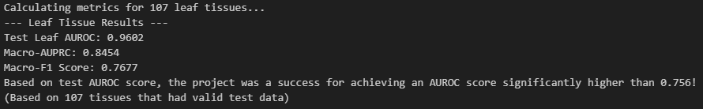
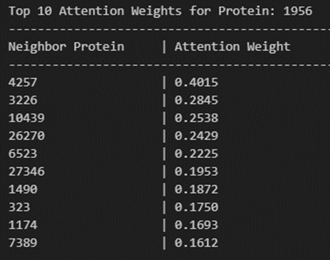

# Late Fusion Graph Attention Network (GAT) for Tissue-Specific Protein Function Prediction

This project explores the application of a **Late Fusion Graph Attention Network (GAT)** to predict tissue-specific functions in complex protein-protein interaction (PPI) networks. Built as an advanced extension of the **OhmNet** study, this architecture replaces unsupervised random-walk features with supervised multi-head attention to enhance both predictive accuracy and biological interpretability.

## 🚀 Key Features

- **Late Fusion GAT Architecture**: Implements the `LateFusionGAT` model, integrating multi-head attention (16 heads) with a multi-layer perceptron (MLP) for feature fusion and classification.
- **Hierarchical Ontological Context**: Leverages `node2vec` embeddings of the **BRENDA Tissue Ontology (BTO)** to provide a global anatomical context for predictions across all 219 defined anatomical nodes.
- **Efficient Data Handling**: Uses `LinkNeighborLoader` from PyTorch Geometric for scalable training on large-scale PPI graphs with batch-based neighborhood sampling.
- **Hierarchical Constrained Loss**: Features a custom loss function with an adaptive penalty that enforces anatomical consistency, ensuring child tissue probabilities do not exceed their parent probabilities.
- **Biological Label Propagation**: Employs a 'bottom-up' propagation algorithm to correct inconsistencies in the raw dataset, ensuring the ground truth follows the "True Path Rule" of biological ontologies.

## 🏗️ Project Structure

- `COMP6841 - Capstone Project - SR.ipynb`: The primary research notebook featuring data preprocessing, model implementation, and final evaluation.
- `data/`: Contains raw PPI datasets, tissue hierarchy files (`tissue.hierarchy`), and BTO documentation (`BrendaTissue.obo`).
- `best_model.pt`: Checkpoint containing weights for the top-performing model (calculated using validation loss early stopping).

## 🔬 Methodology

1. **Hierarchy Embedding**: The Brenda Tissue Ontology is modeled as a directed graph, and `Node2Vec` is applied to capture structural relationships between anatomical sites.
2. **Data Correction & Propagation**: To resolve "Observation Bias"—where interactions were labeled in child tissues but omitted in parent organs—labels were propagated up the hierarchy. This increased global label density from **23.8% to 38.3%**, providing a robust training signal while maintaining a constant leaf node density of **30.57%**.
3. **Graph Sampling**: `LinkNeighborLoader` samples spatial neighborhoods, facilitating memory-efficient training on representative subgraphs.
4. **Late Fusion Mechanism**: Models protein pair interactions using the GAT's contextual encoding, subsequently fusing these features with the hierarchical tissue "address" before final prediction.
5. **Optimization**: Training utilizes a hierarchical-constrained loss function, **Adaptive Penalty Multipliers**, and **Early Stopping** (patience=50).

## 📊 Results

The model significantly exceeds prior benchmarks and the initial project goal of 0.756 AUROC.

- **Test Leaf AUROC**: `0.9602`
- **Macro-AUPRC**: `0.8454`
- **Macro-F1 Score**: `0.7677`

*Note: These results reflect the 0.3 dropout configuration, which showed consistent superiority over higher regularization rates (0.4/0.5).*

## 🧠 Model Interpretability (Attention Analysis)

The attention mechanism identifies functional clusters by prioritizing neighbors with consistent biological roles.

**Hub Analysis: Protein 1956**
A study on this highly connected protein revealed that the GAT captures functional relevance through weighted attention:
- **Top Neighbor**: Protein `4257` (Weight: `0.4015`)
- **Functional Alignment**: Higher weights were observed for biological neighbors sharing the same nervous system tissue tags, confirming the model's ability to filter noise and focus on critical functional pathways.

## 🛠️ Requirements

- Python 3.12+
- PyTorch & PyTorch Geometric
- NetworkX
- Pandas, NumPy, Scikit-learn
- Matplotlib
- GPU with minimum 12GB VRAM required

## 🏃 Usage

1. **Populate Data**: Ensure all PPI and BTO files are located in the `data/` directory.
2. **Execute Workflow**: Open `COMP6841 - Capstone Project - SR.ipynb` and run cells sequentially to:
   - Generate tissue embeddings.
   - Train the `LateFusionGAT` model (optional, load weights from `best_model.pt` to skip training).
   - Visualize attention weights for network hub proteins.
3. **Evaluation**: Use the provided `best_model.pt` to replicate the leaf-tissue metrics analysis.

---

**Statement of Technical Implementation**: This project was conceptualized and directed by the author. While the core biological logic, hierarchical constraints, and data auditing were original contributions, AI assistance was utilized for the technical implementation of the PyTorch Geometric framework and for vectorizing the custom hierarchical loss function. All architectural choices and hyperparameters were iteratively validated and tuned by the author to ensure biological consistency. The notebook clearly defines what is authored and what is assisted.

